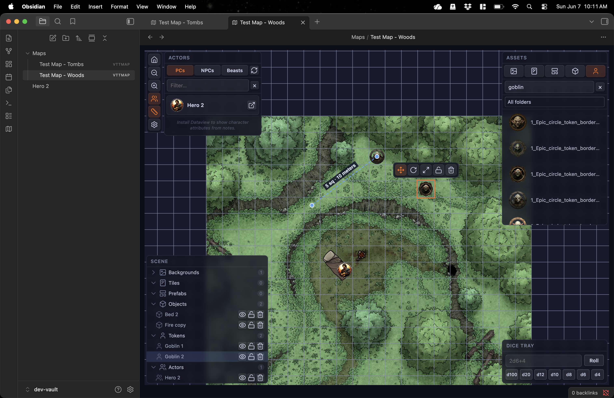
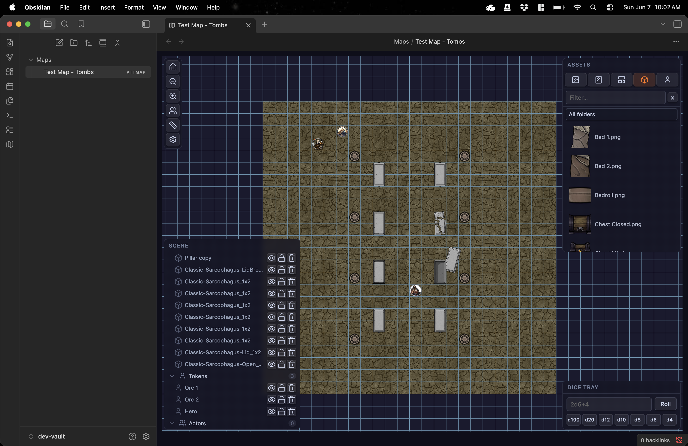

# Obsidian VTT

This project is a plugin for [Obsidian](https://obsidian.md). The purpose of the plugin is to implement a simple Virtual Tabletop (VTT) for tabletop role-playing games (TTRPGs), within Obsidian.

NOTE THAT THIS PROJECT IS IN **ACTIVE DEVELOPMENT**, SO FEATURES MAY BE MODIFIED OR CHANGED.

## Screenshots

> A VTT map using a pre-made background image created by [AfternoonMaps](https://www.deviantart.com/afternoonmaps/art/Woodland-Den-battle-map-20x20-Free-Version-764422915)

> A VTT map created using tiles and objects by [Forgotten Adventures](https://www.forgotten-adventures.net/) 

## Why this plugin?

First, I am a solo roleplayer who loves to use Obsidian VTT to manage game rules, record world lore, keep session notes, and store character details. Obsidian is a wonderful tool for connecting the different aspects of a game world.

While there are a lot of VTTs out there, many of them include features that are not really necessary for solo roleplay -- things like networking, advanced lighting, fog of war, and so on.

In addition, while there is some integration between VTTs (like Foundry) and Obsidian, there is no integration that favors an "Obsidian-first" approach.

So, I decided to create a plugin to fill that specific niche.

## Features

- Seamless integration with Obsidian: Install, enable, go!
- Simple map format (`.vttmap`): Maps are saved in human-readable JSON
- System-agnostic game board: Users bring the rules
- Bring your own assets: Just drag-and-drop them into a scene
	- Support for 5 asset types: backgrounds, tiles, prefabs, objects, and tokens
	- Note that prefabs are intended for more complex assets (like buildings with roofs) -- features to use these capabilities will be introduced later
- No arbitrary limit on map size
- Lightweight but "typical" VTT experience featuring:
	- Configurable grid size
	- Easily manage asset position, rotation, and size
	- Easily lock static assets
	- Snap assets to the grid
	- Simple measurement tool with logic for typical diagonal measurement schemes used in RPGs
	- Support for dice formulae
	- Sane defaults, easily configured via Obsidian's Settings UI
	- Map-configurable settings for flexibility

## Support

 If you find this plugin useful or fun, and you want to support me, you can <a href="https://ko-fi.com/denverandy">send me a tip or buy me a coffee</a>, to keep me motivated!

